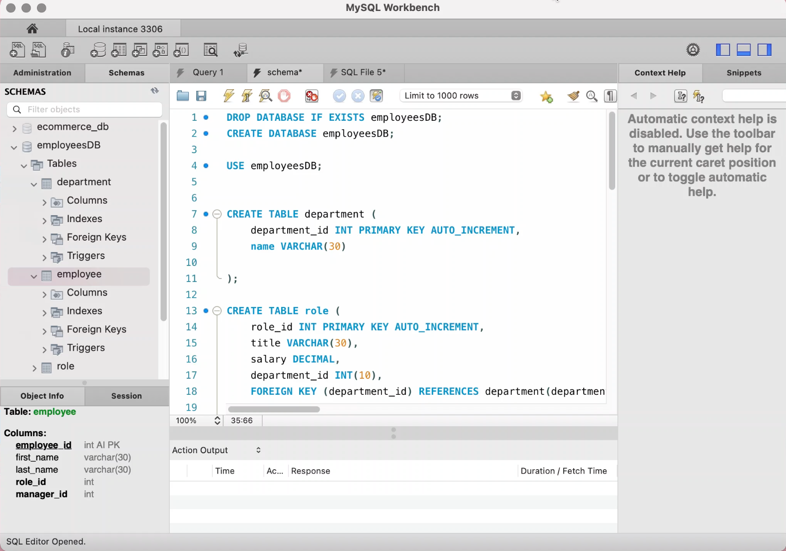

# Unit 12 MySQL Homework: Employee Tracker

## Table of Contents
[Description](#description)  
[Installation](#Installation)  
[Test](#Testing)  
[Project Links](#Repo)  
[Contributors](#Contributors)  

## Description
* This app is used to sort through all company employees. They are listed by Roles, Departments, and Employees.

## Installation
* No installations needed.

## Testing
* None available

## Repo
* [Repo](https://github.com/delmymm/Del.Mel-Homework-12)
* [Link](https://drive.google.com/file/d/1cTaY2IHhBDM9FWNXGdqf-jS1mmRnm512/view?usp=sharing)

## Contributors
* Contributor: [Delmy Melendez](https://github.com/delmymm)